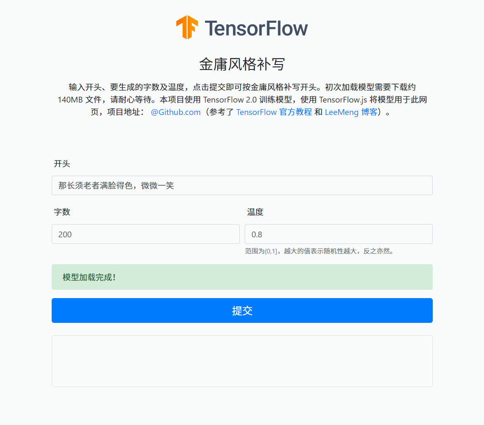
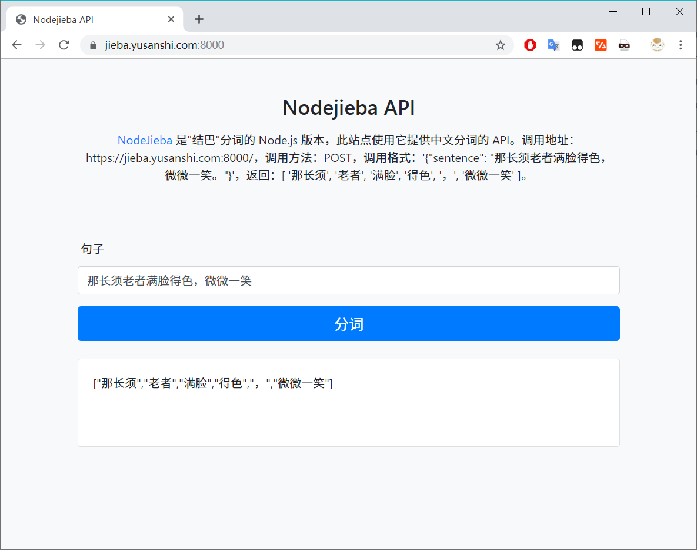

# 金庸风格补写

## 简介

输入开头、要生成的字数及温度，点击提交即可按金庸风格补写开头。

演示站：https://yusanshi.com/Louis_Cha/ ，参考了 [TensorFlow 官方教程](https://www.tensorflow.org/beta/tutorials/text/text_generation) 和 [LeeMeng 博客](https://leemeng.tw/how-to-generate-interesting-text-with-tensorflow2-and-tensorflow-js.html)。

从动图可以看到，温度值较高时（0.8、1.0），生成的文字较随机，当温度值变低时（如 0.01），会导致更不随机，往往表现为文字的重复（原因是此时拥有最大概率的候选词几乎每次都被选到了）。总结之，温度值较高，最终的选词集中在少数几个有较大概率的候选词上；温度值较低，本身概率没那么大的候选词也会容易被选到。

## 基本原理

### Python 版
Python 版主要参考了 [TensorFlow 官方教程](https://www.tensorflow.org/beta/tutorials/text/text_generation)，此处不再详细介绍。运行`main.py`即可。

### 网页版

#### 模型保存

若`apply.py`中`apply`函数的`save_to_JS`参数为`True`，则会保存下来`data.json`（是字段和序号间对应关系的一个字典）和可在 Tensorflow.js 中加载的模型。

#### 前端

在`website`文件夹中，分为前端`front_end`和`back_end`后端。前端包含主站 https://yusanshi.com/Louis_Cha/ 的源码，亦包括使用 Tensorflow.js 来生成字符序列的 Javascript 代码。

#### 后端

后端是使用 Node.js 搭建的用于提供中文分词服务的 API（这个分词服务用于对用户输入的开头分词）。核心的分词服务用的是 [NodeJieba](https://www.npmjs.com/package/nodejieba)，HTTPS 服务器用的是 [express](https://www.npmjs.com/package/express)，跨域访问问题用 [cors package](https://www.npmjs.com/package/cors) 解决，免费 HTTPS 证书由 [Let's Encrypt](https://letsencrypt.org/) 签发（之所以要给 API 添加对 HTTPS 的支持，是因为我的主站也是 HTTPS 的，不允许向 HTTP 地址发送 Ajax 请求）。 API 请求地址为 https://jieba.yusanshi.com:8000/ （POST 方法），同时也提供对 GET 请求的处理，直接访问这个地址即可在线体验（或检查该 API 有没有挂掉233），如下图。

## 配置

1. 配置 Python 环境，利用 pip 工具安装配置 Tensorflow 2.0（写此 README 时最新版是 TensorFlow 2.0 RC）和其他 Packages；
2. 调整`config.py`中的参数，运行`main.py`训练并查看训练效果（训练的时候可以使用`tensorboard --logdir log`命令实时查看 loss 的值），之后运行`apply.py`并将`save_to_JS`参数设为`True`来保存模型和字典（tfjs 文件夹和`data.json`），将 tfjs 文件夹和`data.json`一起放入`front_end`，将整个`front_end`的内容放入网站文件夹中；
3. 服务器端配置好 NPM 和 Node.js 的环境，安装`nodejieba`和`express`包，修改`app.js`中的`options`中的文件路径为对应`pem`文件的地址（详见 [Let's Encrypt](https://letsencrypt.org/)），`node app.js`运行之；
4. 浏览器访问`front_end`中内容即可。

> 也可以利用 [Browserify](http://browserify.org/)，直接使用 Nodejieba 而不再搭建 API。

## 其他

### 数据集

从网上搜集到金庸老师的作品之后（txt格式），我对每部作品进行了处理（去掉“注”部分和“按”部分、多行空行转成一行），并打包放在了 https://yun.yusanshi.com/TF_datasets/Louis_Cha_novels.zip 。

> 依照《中华人民共和国著作权法》第二十二条“可以不经著作权人许可”的几种情况，请仅基于研究深度学习的目的使用本数据。

